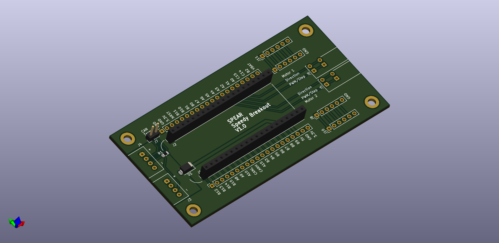

# Speedy Breakout
This is a basic breakout board for our Speedy Microcontroller.

Dimensions: 100 mm x 50 mm

## Features
- Passes 5V power from CAN bus to Speedy
- CAN connectors (Molex Mini-Lock)
- Optional CAN termination, enabled with a jumper
- Dedicated connectors to connect to motor drivers (Step/Direction or PWM/Direction)
- Through holes for all Speedy pins to ease post manufacture additions
- Through holes for adding 2.54 mm compatible headers for things like encoders

## Changelog
### V1.0: Initial design
#### Notes
- Pins A0-A3, used for the motor driver outputs, would typically be mapped to
  the 32-bit Timer 2 in the STM32, which we normally have used for the ChibiOS
  system timer. ChibiOS can use 16-bit timers so this can be worked around.
- Pins A2 and A3 on the Speedy are connected to the ST-Link chip for UART to
  USB functionality, and it seems like the ST-Link was pulling them high,
  interfering with motor driver operation. The UART functionality is provided
  by the [Black Magic Probe](https://black-magic.org/index.html) firmware. This
  can be worked around by reflashing the ST-Link MCU with official ST-Link
  firmware, which doesn't have the UART functionality.
- The CUI TBL009-254 screwless terminal blocks used for the motor driver
  outputs are a too small for stranded 22 AWG wire with wire ferrules.
